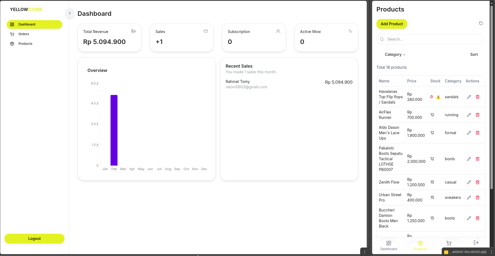

# 🟡 Yellow Store


---
[](https://opensource.org/licenses/MIT) [](https://nextjs.org/) [](https://supabase.com/)

Yellow Store is a mini e-commerce application built with Next.js and Supabase, featuring Midtrans payment integration, realtime order updates, and a secure admin dashboard with Supabase authentication.

The UI follows a yellow-themed design optimized for a shoe store,
but the system can be easily adapted for other products.


## 🚀 Demo
You can try the app live here: [Yellow Store](https://yellowstore-mu.vercel.app)

## Screenshots

### Store


### Admin Dashboard



## ✨ Features

### 🛒 Store

- Display products with pricing & subtotals
- Cart & checkout flow
- Midtrans payment integration
- Invoice page
- Realtime order status updates

### 🔐 Authentication

- User login & session management via Supabase Auth
- Google sign up and login
- Protected routes
- Role-based access (admin / user)

### 📊 Admin Dashboard
- Secure admin-only pages
- View & manage orders
- Update order status
- Realtime data updates


## ⚙️ Technologies Used

- **Next.js 16.1.6** with Turbopack
- **React** + **Zustand** for state management
- **Supabase** for database and realtime updates
- **TailwindCSS** for styling
- **Midtrans** as the payment gateway
- **Nodemailer** for email notifications
- UI components using **shadcn/ui** (Card, Badge, Separator, etc.)


## ⚡ Setup & Installation

1. Clone the repository:

```bash
git clone https://github.com/tosrv/Mini-Store.git
cd Mini-Store
```

2. Install dependencies:

```bash
npm install
# or
yarn install
```

3. Create `.env.local` file in the project root:

```env
# Supabase
NEXT_PUBLIC_SUPABASE_URL=your-project-url
NEXT_PUBLIC_SUPABASE_PUBLISHABLE_KEY=your-publishable-or-anon-key
WEBHOOK_SECRET=your_secret

# Midtrans
NEXT_PUBLIC_MIDTRANS_CLIENT_KEY=your_client_key_here
MIDTRANS_SERVER_KEY=your_server_key_here

# Email (Gamil SMTP example)
EMAIL_USER=yourgmail@gmail.com
EMAIL_PASS=app_password_16_digit

# Base URL for links (localhost or production)
NEXT_PUBLIC_BASE_URL=your_host
```

4.  Run the development server:

```bash
npm run dev
# or
yarn dev
```

Open your browser at [http://localhost:3000](http://localhost:3000)


## 📘 Usage

### Customer Flow

1. Sign up / log in using Supabase Auth (email or Google).
2. Browse available products.
3. Add products to the cart.
4. Proceed to checkout and choose a payment method.
5. Complete payment via Midtrans.
6. After payment, the user is redirected to the invoice page.
7. Order status updates automatically in realtime.

### Admin Flow

1. Log in with an admin account.
2. Access the admin dashboard.
3. Monitor incoming orders.
4. Update order statuses.
5. Changes propagate instantly via Supabase Realtime.


